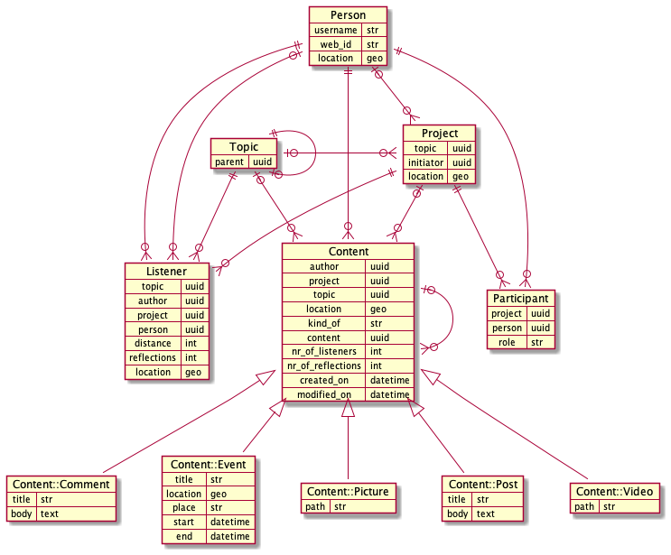

# DB

### Structure




### Setup

```
julia> using Genie
julia> using SearchLight
julia> using SearchLightPostgresSQL

julia> SearchLight.Configuration.load() |> SearchLight.connect

julia> SearchLight.Migration.create_migrations_table()
julia> SearchLight.Migration.status()
```

